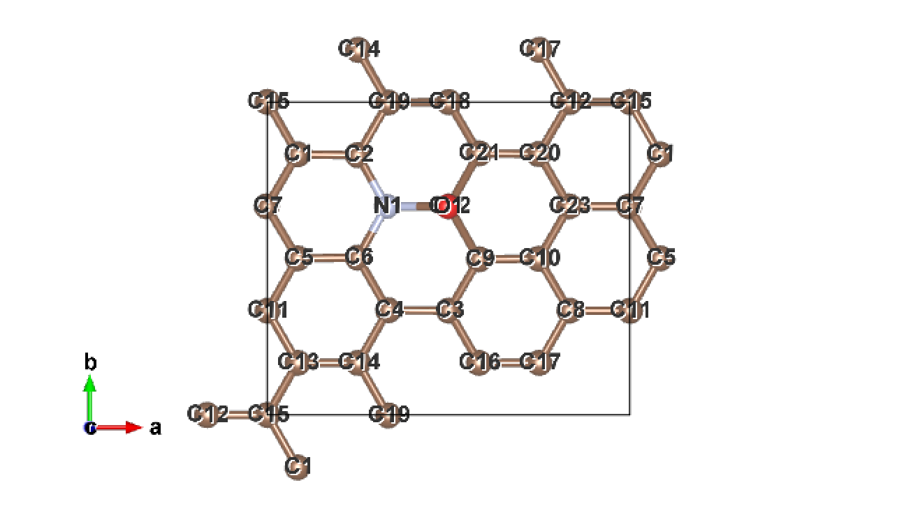
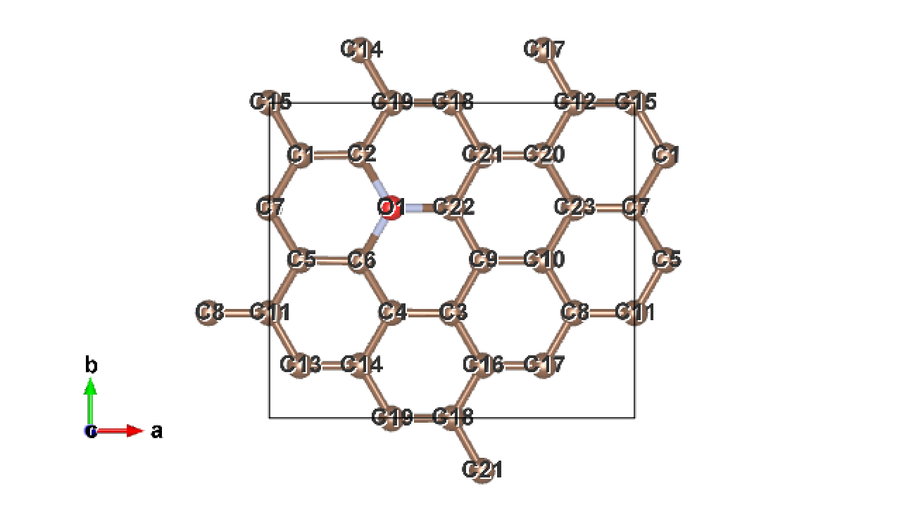
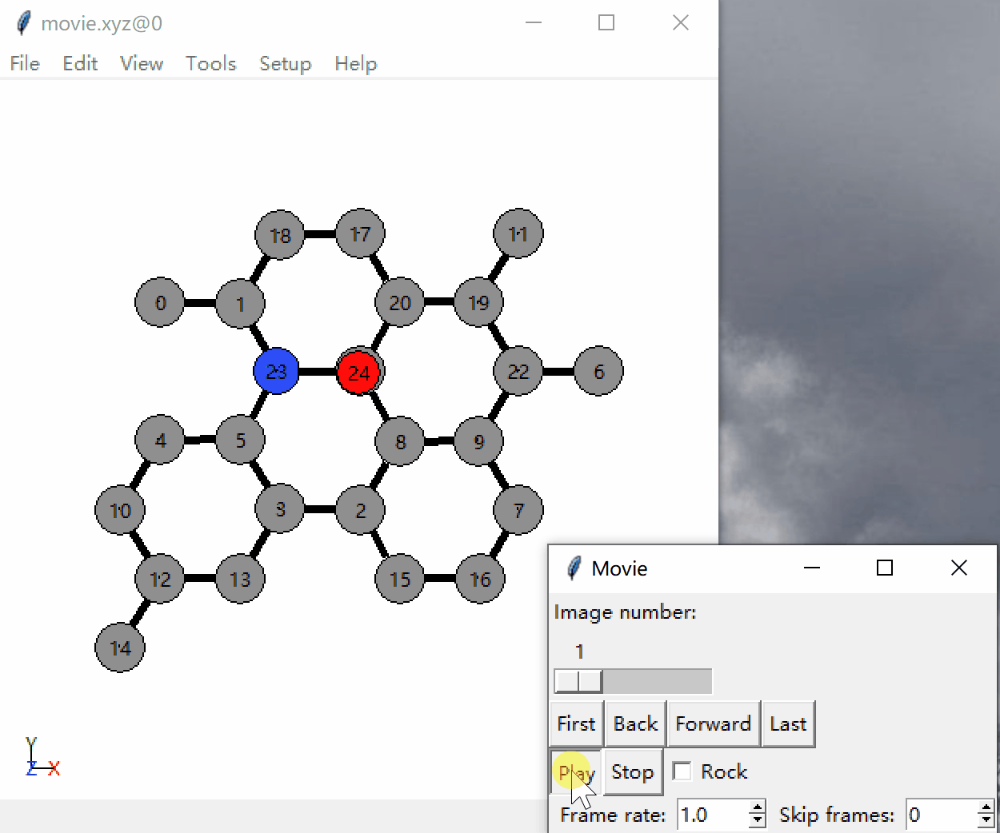
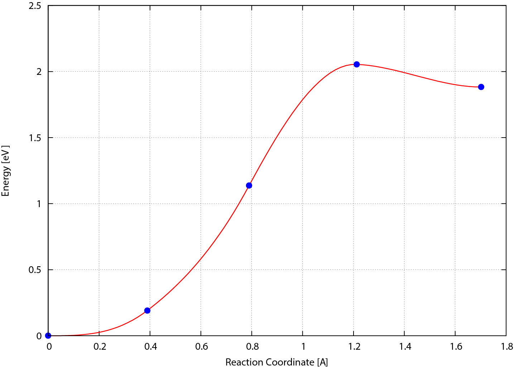

# 使用 NEB 方法计算反应路径

## 流程

1. 分别对初态和末态进行结构优化
2. 使用脚本生成中间过程图像(结构)
3. NEB 计算
4. 处理结果

## 文件结构

::: details


> 这张图整挺好，直接拿过来了， [这是原地址](cndaqiang.github.io/2018/12/07/NEB/) 。

```
[zjb@op neb]$ tree
.
├── ini                ***初态常规结构优化***
│   ├── CONTCAR            -初态优化后的结构——新的初态
│   ├── INCAR              -初态结构优化的输入文件1
│   ├── ini2.vasp          -
│   ├── KPOINTS            -初态结构优化的输入文件2
│   ├── OSZICAR
│   ├── OUTCAR
│   ├── out.log
│   ├── POSCAR             -初态结构优化的输入文件3
│   ├── POTCAR             -初态结构优化的输入文件4
│   ├── stdout
│   ├── vasp.pbs
├── fin                ***末态常规结构优化***
│   ├── CONTCAR            -末态优化后的结构——新的末态
│   ├── fin2.vasp
│   ├── INCAR
│   ├── KPOINTS
│   ├── OSZICAR
│   ├── OUTCAR
│   ├── out.log
│   ├── POSCAR
│   ├── POTCAR
│   ├── stdout
│   └── vasp.pbs
├── 00                 ***↓↓↓*****中间态*****↓↓↓***
│   ├── OUTCAR            -初态结构优化后的OUTCAR   ../ini/OUTCAR
│   ├── POSCAR            -初态结构优化后的CONTCAR  ../ini/CONTCAR
│   └── POSCAR.xyz
├── 01
│   ├── CONTCAR
│   ├── OUTCAR
│   ├── POSCAR
│   └── POSCAR.xyz
│   └── stdout
├── 02
│   ├── CONTCAR
│   ├── OUTCAR
│   ├── POSCAR
│   ├── POSCAR.xyz
│   └── stdout
├── 03
│   ├── CONTCAR
│   ├── OUTCAR
│   ├── POSCAR
│   ├── POSCAR.xyz
│   └── stdout
├── 04
│   ├── OUTCAR            *末态结构优化后的OUTCAR  ../fin/OUTCAR
│   ├── POSCAR            *末态结构优化后的CONTCAR ../fin/CONTCAR
│   └── POSCAR.xyz     ***↑↑↑*****中间态*****↑↑↑***

├── INCAR              ***neb计算的输入文件等***
├── KPOINTS
├── movie
├── movie.xyz
├── neb.dat
├── out.log
├── POTCAR
├── stdout
├── vasp.pbs
└── vasprun.xml
```

:::

## 步骤

### Step1. 分别对初态和末态进行常规的结构优化

上课时的例子是 `O 在 N 掺杂的石墨烯上的吸附 `，其中 `INCAR` 为

::: details

```
Global Parameters
ISTART =  0            (Read existing wavefunction; if there)
LREAL  = .FALSE.          (Projection operators: automatic)
ENCUT  =  400        (Cut-off energy for plane wave basis set, in eV)
PREC   =  Normal       (Precision level)
LWAVE  = .FALSE.        (Write WAVECAR or not)
LCHARG = .FALSE.        (Write CHGCAR or not)
ALGO = Fast

Electronic Relaxation
ISMEAR =  0            (Gaussian smearing; metals:1)
SIGMA  =  0.1         (Smearing value in eV; metals:0.2)
NELM   =  60           (Max electronic SCF steps)
NELMIN =  4            (Min electronic SCF steps)
EDIFF  =  1E-04        (SCF energy convergence; in eV)

Ionic Relaxation
NSW    =  100          (Max electronic SCF steps)
IBRION =  2            (Algorithm: 0-MD; 1-Quasi-New; 2-CG)
ISIF   =  0          (Stress/relaxation: 2-Ions, 3-Shape/Ions/V, 4-Shape/Ions)
EDIFFG = -1E-01        (Ionic convergence; eV/AA)
POTIM = 0.3
```

:::

> [!warning]
> 两个`POSCAR`中，**元素顺序必须对应**，要不然后面测相似度会出问题，会变得很大。（通过cif2pos和xsd2pos的默认排的顺序不一样哦，已踩坑）



上图：初态结构优化后的

下图：末态结构优化后的



初末态看起来不一样是因为周期性导致的，只是显示的不同而已。

### Step2. 使用脚本处理中间过程

结构优化后，原初末态的 `CONTCAR` 就成为了新的初态和末态

#### 对初末态测相似度以确定插点数量

```bash
# Usage
$ dist.pl <初态结构> <末态结构>

# This example
[zjb@op 3-NEB_O_graphene]$ dist.pl ini/CONTCAR fin/CONTCAR 
1.55500097020471
```

> [!tip]
> 若返回值<5，通常可以下一步
> 
> 插点数量通常是 ` 相似度/0.8`.

#### 插入中间图像

`nebmake.pl` 以线性进行插点。

```bash
# Usage
$ nebmake.pl <初态结构> <末态结构> <插点数量>

# This example
[zjb@op 3-NEB_O_graphene]$ nebmake.pl ini/CONTCAR fin/CONTCAR 3   # 3为插点数量，咱这儿把它记为N
filetype1: vasp5
filetype2: vasp5

OK, ALL SETUP HERE
FOR LATER ANALYSIS, PUT OUTCARs IN FOLDERS 00 and 04 !!!
```

> [!warning]
> 提交任务时，CPU 需要是插点数量 N 的整数倍

这一步执行后，会生成 N+1 个文件夹，其中 00 是初态，N+1 是末态。同时会把 `ini/CONTCAR` 复制到 `00/POSCAR`，把 `fin/CONTCAR` 复制到 `N+1/POSCAR`。

根据这一步返回的提示，分别将初末态的 `OUTCAR` 复制到 `00` 和 `N+1` 文件夹，以便于后续分析。

```bash
cp ini/OUTCAR 00/
cp fin/OUTCAR 04/
```

#### 使用 nebmovie 查看生成的路线是否合理

```bash
$ nebmovie.pl
```

执行后会生成 `movie.xyz` 文件，`ase-gui 文件路径 ` 查看。



### Step3. NEB 计算

#### 准备 NEB 计算的输入文件

`POTCAR` 和 `KPOINTS` 不用改直接复制过来就好，不用准备 POSCAR，他已经在上一步被放进 `00/` 和 `04/` 中了,

`INCAR` 要修改不少东西：

``` 
Global Parameters
 NPAR   =  6           插点个数N的整数倍
 
Electronic Relaxation
 EDIFF  =  1E-05
  
Ionic Relaxation
 NSW    =  100         (Max ionic steps)
 IBRION =  3           (Algorithm: 0-MD; 1-Quasi-New; 2-CG)
 POTIM  =  0            IBRION = 3, POTIM = 0，是VTST识别并启动VTST优化算法的标致
 ISIF   =  0           (Stress/relaxation: 2-Ions, 3-Shape/Ions/V, 4-Shape/Ions)
 EDIFFG =  -0.2        (Ionic convergence; eV/AA)

NEB
 LCLIMB   =  .FALSE.     爬坡（CI-NEB），由于要用neb而不是cineb，所以关闭。
 ICHAIN   =  0           开启NEB方法
 IMAGES   =  3           插点个数
 IOPT     =  7           VTST的优化算法。1-2适合精收敛，7适合粗收敛
 MAXMOVE  =  0.1
 TIMESTEP =  0.05 
```

> [!note]
> 发现 MAXMOVE=0.2，TIMESTEP=0.1，EDIFF=1E-04，收敛的更快一些。精度的问题罢辽，可以分两次进行，先粗后细呢。

详见 [Nudged Elastic Band Options | VTST Tools](#nudged-elastic-band-options) 和 [Optimizer input parameters(IOPT) | VTST Tools](http://theory.cm.utexas.edu/vtsttools/optimizers.html) 。

#### 提交计算

修改 PBS 脚本文件的核数。数量是插点数量 N 的整数倍。（第 4 行）

注意 walltime，适当长一些。（第 5 行）

修改 PBS 脚本，使其调用 VTST 编译的 VASP 进行计算（第 13，27 行）

> [!warning]
> 需要注意 VTST 编译的时候是使用哪种 mpi（intel mpi OR open mpi）进行并行运行的，如下高亮行 12-13。如果 mpi 选择有误，会出现只算一个点，而其他点不动的情况（反映在 stdout 里是用 6 个核分别把第一个点算了 1 遍，等于把第一个点算了 6 遍），这个问题直到我尝试自己编译 vasp 的时候才发现原因。

```bash {13,27}
[zjb@op test-vtst-neb]$ cat vasp-vtst.pbs 
#!/bin/sh
#PBS -N Untitled
#PBS -l nodes=1:ppn=6
#PBS -l walltime=05:30:00
#PBS -j oe
#PBS -o ./out.log
#PBS -q energy

cd ${PBS_O_WORKDIR}
source /public/software/profile.d/compiler_intel-composer_xe_2015.2.164.sh
# source /public/software/profile.d/mpi_intelmpi-5.0.2.044.sh
source /public/software/profile.d/mpi_openmpi-2.0.0-intel.sh
echo "============================================="
echo "Starting VASP at" `date` 
echo "---------------------------------------------"
echo "VTST VASP"
echo "The PBS_O_WORKDIR is" $PBS_O_WORKDIR
echo "The PBS_JOBID     is" $PBS_JOBID
echo "The PBS_JOBNAME   is" $PBS_JOBNAME
echo "The PBS_O_QUEUE   is" $PBS_O_QUEUE
echo "The PBS_O_HOST    is" $PBS_O_HOST
NP=`cat $PBS_NODEFILE | wc -l`
echo "The num of PBS_NODEFILE is" $NP
echo "The PBS_NODEFILE IS:" 
cat $PBS_NODEFILE
mpirun -np $NP -machinefile $PBS_NODEFILE /public/software/apps/vasp/5.4.1/vtst-ompi/vasp_std >& stdout
echo "---------------------------------------------"
echo "End task at " `date` 
echo "============================================="
```

脚本因机器实际环境不同而需要更改，但大同小异。

> [!note] NOTE: NEB 接着算
> 如果算了一半被 kill 了，要接着算，只需要把 00、01、02 下的 `CONTCAR` 覆盖 `POSCAR`，然后再次提交就可。

#### 检查是否收敛

```bash
# Usage
$ nebef.pl

# This example
[zjb@op test-vtst-neb]$ nebef.pl 
   0         0.000000      -224.399900         0.000000 
   1         0.148350      -224.208300         0.191600 
   2         0.132181      -223.262900         1.137000 
   3         0.096709      -222.345700         2.054200 
   4         0.000000      -222.517000         1.882900 
```

返回结果为 ` 序号 `—` 最大原子受力 ` —` 能量 `—` 相对初态的能量 `.

当所有插点的最大原子受力都 < |EDIFFG| 时，计算收敛。

> [!tip]
> 如果发现这一步受力那一列全是 0，可以考虑检查一下是否调用了 VTST 编译的 VASP 进行计算。

#### 检查切向力

```bash
# Usage
$ nebbarrier.pl && cat neb.dat

# This example
[zjb@op test-vtst-neb]$ nebbarrier.pl && cat neb.dat
  0     0.000000     0.000000     0.000000   0
  1     0.389947     0.191613    -1.474390   1
  2     0.789822     1.137031    -3.591041   2
  3     1.212818     2.054245     0.086021   3
  4     1.701348     1.882893     0.000000   4
```

返回结果为 ` 序号 `——` 距离 `——` 能量 `——` 切向力 `。

- 该命令没有输出到屏幕的内容，而是生成 neb.dat 文件。
- 第二列表示距离(即临近两结构的 dist.pl 的计算结果)，
- 第三列表示能量(以初态能量为参考值)，
- 第四列为切向力(forces along the neb)
  过渡态附近切向力会正负变号，而且接近 0。（例如 3）

#### ~~频率计算~~

Todo...

#### 打包结果

```bash
# Usage
$ nebresult.pl

# This example
[zjb@op test-vtst-neb]$ nebresults.pl 

Unziping the OUTCARs ... done
Do nebbarrier.pl ; nebspline.pl
Do nebef.pl
Do nebmovie.pl
Do nebjmovie.pl
Do nebconverge.pl

Forces and Energy:
   0         0.000000      -224.399900         0.000000 
   1         0.148350      -224.208300         0.191600 
   2         0.132181      -223.262900         1.137000 
   3         0.096709      -222.345700         2.054200 
   4         0.000000      -222.517000         1.882900 

Extremum 1 found at image  0.000000 with energy:  0.000000
Extremum 2 found at image  0.000330 with energy: -0.000000
Extremum 3 found at image  2.985984 with energy:  2.054500
```

从输出和源码可以了解到，`nebresult.pl` 做的事情如下：

0. ~~解压缩 OUTCAR.tg~~

1. 执行 `nebbarrier.pl`，该脚本生成 `neb.dat`，将收敛情况，NEB 方向力，能量，写入

2. 执行 `nebspline.pl`，该脚本对 `neb.dat` 里 能量和距离 的关系进行插值，插值结果写入 `spline.dat` 文件，所有极值的位置和能量写入 `exts.dat`，把 MEP 画成 `mep.eps`。
    `mep.eps` 是以 `dist.pl` 距离为横坐标，能量为纵坐标画出的能势垒图，可用矢量图编辑软件打开，我们也可以使用 `neb.dat` 的数据用 Origin 画图。

3. 执行 `nebef.pl`，并将其结果（力和能量）写入 `nebef.dat`。

4. 执行 `nebmovie.pl`， 该脚本生成结构变化

5. 执行 `nebjmovie.pl`，

6. 执行 `nebconverge.pl`

7. ~~还有对各文件夹中的 OUTCAR 打包压缩。~~ 我在源码里注释掉了这一部分。

8. 屏显 `nebef.dat` 和 `exts.dat`。

    生成的 vaspgr 文件夹内是各个插点结构的收敛图。

具体见 [Nudged Elastic Band Scripts | VTST Tools](#nudged-elastic-band-scripts)

其中 mep.eps 就是这样子：



## 其他

### [Nudged Elastic Band] Scripts

 [Nudged Elastic Band Scripts | VTST Tools](http://theory.cm.utexas.edu/vtsttools/scripts.html#nudged-elastic-band-scripts)

::: details
<table class="docutils align-default">
<colgroup>
<col style="width: 14%">
<col style="width: 86%">
</colgroup>
<thead>
<tr class="row-odd"><th class="head"><p>Scripts</p></th>
<th class="head"><p>Usage/Description</p></th>
</tr>
</thead>
<tbody>
<tr class="row-even"><td rowspan="3"><p><strong>nebmake.pl</strong></p></td>
<td><p>usage: <code class="docutils literal notranslate"><span class="pre">nebmake.pl</span> <span class="pre">(POSCAR1)</span> <span class="pre">(POSCAR2)</span> <span class="pre">(number</span> <span class="pre">of</span> <span class="pre">images,</span> <span class="pre">NI)</span></code></p></td>
</tr>
<tr class="row-odd"><td><p>output: <code class="docutils literal notranslate"><span class="pre">directories</span> <span class="pre">[00,NI+1]</span> <span class="pre">containing</span> <span class="pre">initial</span> <span class="pre">NEB</span> <span class="pre">POSCAR</span> <span class="pre">files</span></code></p></td>
</tr>
<tr class="row-even"><td><p>Takes initial and final POSCAR files, and linearly interpolates the specified number of images between them. The interpolated files are

written to the directories 00 to NI+1, where NI is the number of specified images.</p></td>

</tr>
<tr class="row-odd"><td rowspan="3"><p><strong>neb2dim.pl</strong></p></td>
<td><p>usage: <code class="docutils literal notranslate"><span class="pre">neb2dim.pl</span> <span class="pre">or</span> <span class="pre">neb2dim.pl</span> <span class="pre">(number</span> <span class="pre">of</span> <span class="pre">an</span> <span class="pre">image)</span></code></p></td>
</tr>
<tr class="row-even"><td><p>output: <code class="docutils literal notranslate"><span class="pre">directory</span> <span class="pre">saddle_dimer</span> <span class="pre">containing</span> <span class="pre">files</span> <span class="pre">for</span> <span class="pre">dimer</span> <span class="pre">run</span></code></p></td>
</tr>
<tr class="row-odd"><td><p>Sets up a dimer run from a NEB run. It is assumed that the configuration is contained in POSCARs, i.e. vfin.pl has been run. If no input

argument is given then the dimer is formed by interpolation around the highest point in the exts.dat file. Otherwise it is formed around the

input image. Curvature data from the MEP is used for the initial orientation of the DIMER.</p></td>

</tr>
<tr class="row-even"><td rowspan="3"><p><strong>neb2lan.pl</strong></p></td>
<td><p>usage: <code class="docutils literal notranslate"><span class="pre">neb2lan.pl</span> <span class="pre">or</span> <span class="pre">neb2lan.pl</span> <span class="pre">(number</span> <span class="pre">of</span> <span class="pre">an</span> <span class="pre">image)</span></code></p></td>
</tr>
<tr class="row-odd"><td><p>output: <code class="docutils literal notranslate"><span class="pre">directory</span> <span class="pre">saddle_lanczos</span> <span class="pre">containing</span> <span class="pre">files</span> <span class="pre">for</span> <span class="pre">lanczos</span> <span class="pre">run</span></code></p></td>
</tr>
<tr class="row-even"><td><p>Sets up a lanczos run from a NEB run. It is assumed that the configuration is contained in POSCARs, i.e. vfin.pl has been run. If no input

argument is given then the run is set up by interpolation around the highest point in the exts.dat file. Otherwise it is set up around the

input image. Curvature data from the MEP is used for the initial MODECAR.</p></td>

</tr>
<tr class="row-odd"><td rowspan="2"><p><strong>nebef.pl</strong></p></td>
<td><p>usage: <code class="docutils literal notranslate"><span class="pre">nebef.pl</span></code></p></td>
</tr>
<tr class="row-even"><td><p>output: <code class="docutils literal notranslate"><span class="pre">energy</span> <span class="pre">and</span> <span class="pre">force</span> <span class="pre">of</span> <span class="pre">images</span> <span class="pre">in</span> <span class="pre">the</span> <span class="pre">neb</span></code></p></td>
</tr>
<tr class="row-odd"><td rowspan="3"><p><strong>nebbarrier.pl</strong></p></td>
<td><p>usage: <code class="docutils literal notranslate"><span class="pre">nebbarrier.pl</span></code></p></td>
</tr>
<tr class="row-even"><td><p>output: <code class="docutils literal notranslate"><span class="pre">energy,</span> <span class="pre">distance,</span> <span class="pre">and</span> <span class="pre">forces</span> <span class="pre">along</span> <span class="pre">the</span> <span class="pre">neb</span></code></p></td>
</tr>
<tr class="row-odd"><td><p>Generates the file neb.dat which contains the distance between images, the energy of each image, and the force along the band. This data is

used by nebspline.pl to generate a force-based cubic spline along the band.</p></td>

</tr>
<tr class="row-even"><td rowspan="3"><p><strong>nebspline.pl</strong></p></td>
<td><p>usage: <code class="docutils literal notranslate"><span class="pre">nebspline.pl</span></code></p></td>
</tr>
<tr class="row-odd"><td><p>output: <code class="docutils literal notranslate"><span class="pre">spline.dat,</span> <span class="pre">exts.dat,</span> <span class="pre">mep.eps</span></code></p></td>
</tr>
<tr class="row-even"><td><p>Reads the file neb.dat and creates the files spline.dat,exts.dat and mep.eps. spline.dat is a set of points that describe the spline fitted to

the data in the neb.dat while exts.dat contains the location and energy of all extrema found along the curve and mep.eps is a plot of the MEP

path.</p></td>

</tr>
<tr class="row-odd"><td rowspan="3"><p><strong>nebmovie.pl</strong></p></td>
<td><p>usage: <code class="docutils literal notranslate"><span class="pre">nebmovie.pl</span> <span class="pre">(flag)</span></code></p></td>
</tr>
<tr class="row-even"><td><p>output: <code class="docutils literal notranslate"><span class="pre">movie.xyz</span></code></p></td>
</tr>
<tr class="row-odd"><td><p>Can be used to generate a movie from standard xyz files, generated either by POSCARs (flag=0) or CONTCARs (flag=1) in every directory.</p></td>
</tr>
<tr class="row-even"><td rowspan="3"><p><strong>nebconverge.pl</strong></p></td>
<td><p>usage: <code class="docutils literal notranslate"><span class="pre">nebconverge.pl</span></code></p></td>
</tr>
<tr class="row-odd"><td><p>output: <code class="docutils literal notranslate"><span class="pre">directory</span> <span class="pre">(vaspgr)</span> <span class="pre">with</span> <span class="pre">plots</span> <span class="pre">of</span> <span class="pre">energy</span> <span class="pre">and</span> <span class="pre">forces</span></code></p></td>
</tr>
<tr class="row-even"><td><p>Can be used to monitor convergence for each image while the job is still running.</p></td>
</tr>
<tr class="row-odd"><td rowspan="3"><p><strong>nebresults.pl</strong></p></td>
<td><p>usage: <code class="docutils literal notranslate"><span class="pre">nebresults.pl</span></code></p></td>
</tr>
<tr class="row-even"><td><p>output: <code class="docutils literal notranslate"><span class="pre">spline.dat,</span> <span class="pre">neb.dat,</span> <span class="pre">exts.dat,</span> <span class="pre">mep.eps,</span> <span class="pre">movie.xyz,</span> <span class="pre">vaspgr</span></code></p></td>
</tr>
<tr class="row-odd"><td><p>After a run has finished and wrapped up with vfin.pl, the nebresults.pl can be used to run nebef.pl, nebspline.pl, nebmovie.pl and

nebconverge.pl automatically.</p></td>

</tr>
<tr class="row-even"><td rowspan="3"><p><strong>nebfreeze.pl</strong></p></td>
<td><p>usage: <code class="docutils literal notranslate"><span class="pre">nebfreeze.pl</span> <span class="pre">(atom)</span> <span class="pre">(list</span> <span class="pre">of</span> <span class="pre">POSCAR</span> <span class="pre">files)</span></code></p></td>
</tr>
<tr class="row-odd"><td><p>output: <code class="docutils literal notranslate"><span class="pre">POSCAR</span> <span class="pre">files,</span> <span class="pre">to</span> <span class="pre">original</span> <span class="pre">files</span></code></p></td>
</tr>
<tr class="row-even"><td><p>Takes an atom number and a list of POSCAR files and then freezes that atom, as well as shifting the contents of each POSCAR file so that that

atom has the same position in each cell. This is useful if you need to give all POSCARs in a NEB calculation the same frozen point.</p></td>

</tr>
<tr class="row-odd"><td rowspan="4"><p><strong>nebavoid.pl</strong></p></td>
<td><p>usage: <code class="docutils literal notranslate"><span class="pre">nebavoid.pl</span> <span class="pre">distance</span></code></p></td>
</tr>
<tr class="row-even"><td><p>output: <code class="docutils literal notranslate"><span class="pre">POSCAR</span> <span class="pre">files,</span> <span class="pre">to</span> <span class="pre">original</span> <span class="pre">files</span></code></p></td>
</tr>
<tr class="row-odd"><td><p>If atoms are closer than the specified distance, the script pushes these atoms apart. The new geometry is written in the POSCAR file, and the

old saved as POSCAR_orig.</p></td>

</tr>
<tr class="row-even"><td><p>Warning: this script does not give a set of equally spaced images.</p></td>
</tr>
</tbody>
</table>
:::

### [Nudged Elastic Band] Options

 [Nudged Elastic Band Options | VTST Tools](http://theory.cm.utexas.edu/vtsttools/neb.html#nudged-elastic-band-options)

| Variable    | Default Value      | Type    | Description                                                  |
| :---------- | :----------------- | :------ | :----------------------------------------------------------- |
| ICHAIN      | 0 \| int           |         | Indicates which method to run. NEB (ICHAIN=0) is the default |
| IMAGES      | none               | int     | Number of NEB images between the fixed endpoints             |
| SPRING      | -5.0               | float   | The spring constant, in eV/Ang^2 between the images; negative value turns on nudging |
| LCLIMB      | .TRUE.             | boolean | Flag to turn on the climbing image algorithm                 |
| LTANGENTOLD | .FALSE.            | boolean | Flag to turn on the old central difference tangent           |
| LDNEB       | .FALSE.            | boolean | Flag to turn on modified double nudging                      |
| LNEBCELL    | .FALSE.            | boolean | Flag to turn on SS-NEB. Used with ISIF=3 and IOPT=3.         |
| JACOBIAN    | (Ω/N)^{1/3}N^{1/2} | real    | Controls weight of lattice to atomic motion. Ω is volume and N is the number of atoms. |

## 参考资料

- [vasp+VTST 进行 NEB 过渡态计算 | cndaqiang](https://cndaqiang.github.io/2018/12/07/NEB/)
- [vasp-vtst 计算过渡态--NEB 方法 | 刘锦程](http://blog.wangruixing.cn/2019/08/19/cineb/)
- [Nudged Elastic Band Scripts | VTST Tools](http://theory.cm.utexas.edu/vtsttools/scripts.html#nudged-elastic-band-scripts)
- [Nudged Elastic Band Options | VTST Tools](http://theory.cm.utexas.edu/vtsttools/neb.html#nudged-elastic-band-options)
- [FORCE BASED OPTIMIZERS (IOPT) | VTST Tools](http://theory.cm.utexas.edu/vtsttools/optimizers.html)
